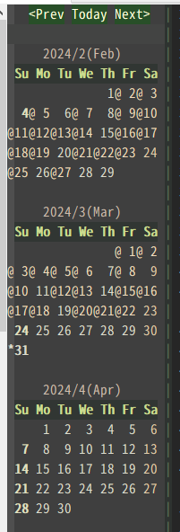

# vim-clmemo-grep

[README in English](README.md)

## $B35MW(B

ChangeLog$B%a%b$r8!:w$9$k$?$a$N(BVim$B%W%i%0%$%s(B

ChangeLog$B%a%b$K$D$$$F$O(B  http://0xcc.net/unimag/1/ $B$r;2>H$N$3$H(B

ChangeLog$B%a%b$H8F$VC10l$N%F%-%9%H%U%!%$%k$r%-!<%o!<%I8!:w$7!"7k2L$r5-;vC10L$G8!:w$9$k$3$H$,$G$-$k!#(B  
$B2<5-$N$h$&$JF0:n(B


## $B;H$$J}(B

### $B%$%s%9%H!<%k(B

$BIaDL$N(BVim$B%W%i%0%$%s$N$h$&$K!"(B`~/.vim`(Windows$B4D6-$J$i(B`~/vimfiles`)$B$KG[CV$9$k!#(B

### $B%3%^%s%I(B

$B%W%i%0%$%s$r%$%s%9%H!<%k$9$k$H!"2<5-$N%3%^%s%I$,;H$($k$h$&$K$J$k!#(B

`CLMemoGrep` / `CLMemoGrepReverse` / `CLMemoCalendarSign`

- `CLMemoGrep`
  -  $B;XDj$7$?%-!<%o!<%I$G(BChangeLog$B%a%b%U%!%$%k$N8!:w$r9T$&!#8!:w7k2L$r@lMQ$N%&%$%s%I%&$KI=<($9$k(B
```
:CLMemoGrep keyword1 keyword2 ...
```

- `CLMemoGrepReverse`
    `CLMemoGrep`$B$N7k2L$r5U=g$KI=<($9$k!#(B
```
:CLMemoGrepReverse keyword1 keyword2 ...
```

- `CLMemoCalendarSign`
  -  `[calendar-vim](https://github.com/mattn/calendar-vim) $B$,F~$C$F$$$k>l9g$O!"8!:w$K%R%C%H$7$?5-;v$,B8:_$9$kF|IU$r%+%l%s%@!<>e$G6/D4I=<($9$k!#(B

```
:CLMemoGrepCalendarSign keyword1 keyword2 ...
```


- $B5-;v$,B8:_$9$kF|IU$K!V(B@$B!W$,IU$/(B

### $B$[$+(B

[calendar-vim](https://github.com/mattn/calendar-vim)$B$r;H$C$F$$$k>l9g!"2<5-$rDj5A$7$F$*$/$H!"%+%l%s%@!<$NF|IU$r%/%j%C%/$9$k$H!"(BChangeLog$B%a%b$NEv3:F|IU$K%8%c%s%W$G$-$k(B

```
let g:calendar_action='CalendarActionCLMemo'
```

### $BJQ?t(B

- `g:clmemogrep_changelogfilepath`
  - ChangeLog$B%a%b$N%U%!%$%k%Q%9$r;XDj$9$k(B

- `g:clmemogrep_fileencoding`
  - ChangeLog$B%a%b$N%(%s%3!<%G%#%s%0$r;XDj$9$k(B($B;XDj$,$J$$>l9g$O(B`&enc`$B$HF1$8$H$_$J$9(B)

- `g:clmemogrep_setfocus` (1 or 0)
  - $B8!:w$r<B9T$7$?$H$-%U%)!<%+%9$r7k2L%&%$%s%I%&$K0\F0$9$k$+$I$&$+$r;XDj$9$k(B

- `g:clmemogrep_fold` (1 or 0)
  - $B8!:w7k2L%&%$%s%I%&$KI=<($9$k7k2L$r@^$j$?$?$`(B(fold)$B$9$k$+$I$&$+$r;XDj$9$k(B

- `g:clmemogrep_showheader` (1 or 0)
  - $B8!:w7k2L%&%$%s%I%&$K8!:w7k2L$N7o?t$rI=<($9$k$+$I$&$+$r;XDj$9$k(B

- `g:clmemogrep_showdate` (1 or 0)
  - $B8!:w7k2L$K5-;v$NF|IU$rI=<($9$k$+$I$&$+$r;XDj$9$k(B

- `g:clmemogrep_Split`
  - $B8!:w7k2L%&%$%s%I%&$NJ,3dJ}K!$r;XDj$9$k(B
    - '' : $B?eJ?J,3d(B
    - `v' : $B?bD>J,3d(B

## $BI,MW$J$b$N(B

- Vim$B$O(B`+python3/dyn' $B$,M-8z$G$"$k$3$H(B
- Vim$B$+$i(BPython3$B$,;H$($k$h$&$K$J$C$F$$$k$3$H(B


