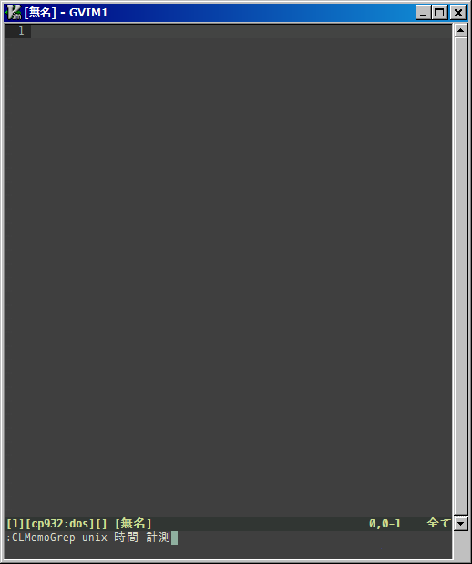
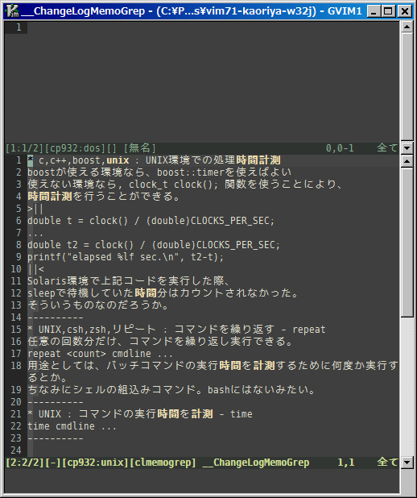
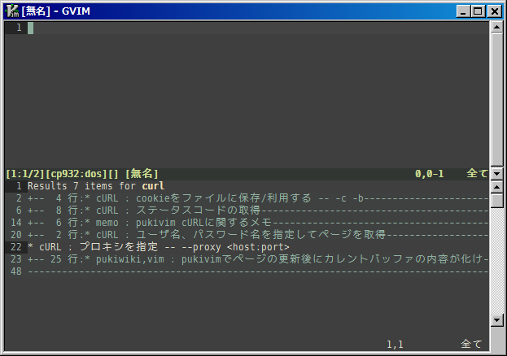

# vim-clmemo-grep

ChangeLogメモを検索するためのVimプラグイン

## ChangeLogメモとは

プログラムの変更履歴を記載するテキストでChangeLogというものがあり、  
これを個人用のメモに活用したのがChangeLogメモ。下記の記事が詳しい。

  http://0xcc.net/unimag/1/

所定の形式で一つのテキストファイルに個人メモを記録しておく、  
それをVim上から記事単位で検索できるようにするのがこのVimプラグイン

### プラグイン実行のイメージ

コマンドから検索ワードを入力する




検索ワードを含むエントリの一覧を表示




折りたたむこともできる




##  インストール方法

他のプラグインと同じで、ダウンロードしたものを `.vim` か `.vimfiles` 以下に展開する。  
プラグインマネージャを使っている場合はその掟にしたがう

##  初期設定

下記の変数を設定しておく。

### 変数

|変数名|説明|
|------|----|
|g:clmemogrep_changelogfilepath|ChangeLogメモのファイルパス(必須) <br> (例: "~/ChangeLogMemo/ChangeLog.txt")|
|g:clmemogrep_setfocus|結果ウインドウにフォーカスを移動するか?(1:移動する 0:移動しない) <br> デフォルト:1|
|g:clmemogrep_fold|検索結果を折り畳み表示するか?(1:折りたたむ 0:折りたたまない) <br> デフォルト:0|
|g:clmemogrep_showdate|検索結果にアイテムの日付を表示するか(1:する 0:しない) <br> デフォルト:0|

他にも細かい設定をする変数があるけどここでは記載していない  
下記に記載している。

https://ampmmn.hatenablog.com/entry/20090219/1235042852

##  使い方

このプラグインを入れると、下記のコマンドが使用できる。

* `CLMemoGrep`
* `CLMemoGrepReverse`

各コマンドの機能を以下に記載する。

|コマンド名|説明|例|
|--|--|--|
|`CLMemoGrep`|指定したキーワードでChangeLogメモファイルを検索する|:CLMemoGrep keyword1 keyword2 ...|
|`CLMemoGrepReverse`|`CLMemoGrep`の結果の表示順序を反転する|:CLMemoGrepReverse keyword1 keyword2 ...|

コマンドを毎回打つのはだるいのでキーマッピングしておくのがよい。  
自分は .vimrc に以下のように記載しておき、`,c`をタイプしたら検索キーワードを入力できるようにしている。

```
noremap ,c :CLMemoGrep<space>
```

##  Pluginの実行に必要なもの

* `+python3`(+`python3/dyn`) 機能ありでビルドされたVimであること
* そのVimと連携して動作可能な Python3.x が実行環境にインストールされ、パスが通っていること
  * `+python`(`+python/dyn`) には対応していない  
(逆に、このプラグインの0.0.6までは`+python`環境で動作する。`+python3`環境では動作しない。)

