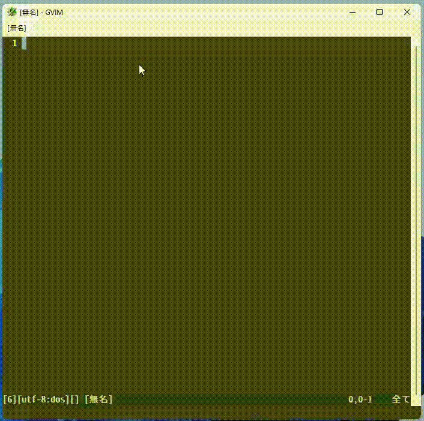

# vim-clmemo-grep

[README in Japsnese](README-ja.md)

## Description

A vim plugin for grepping 'Changelog Memo'.
Changelog Memo is a kind of concept that writting memo into one text file.
For more details, see http://0xcc.net/unimag/1/ (written in Japanese).



## Getting Started

### Installation

Installation is as well as other usual plugins.
Download zip file on github, extract it and place ~/.vim or ~/vimfiles.

### Usage

Once this installation is done, you can use the following commands.

`CLMemoGrep` / `CLMemoGrepReverse` / `CLMemoCalendarSign`

- `CLMemoGrep`
  -  searchs for the given words in the 'Changelog Memo' file.

```
:CLMemoGrep keyword1 keyword2 ...
```

- `CLMemoGrepReverse`
    is same as CLMemoGrep. But the result is listed in resersed order.

```
:CLMemoGrepReverse keyword1 keyword2 ...
```

- `CLMemoCalendarSign`
  -  is same as CLMemoGrep too. And the result is marked on the calendar if [calendar-vim](https://github.com/mattn/calendar-vim) is installed.

```
:CLMemoGrepCalendarSign keyword1 keyword2 ...
```

### Variables

- `g:clmemogrep_changelogfilepath`
  - Specifies file path of the ChanegLog memo.

- `g:clmemogrep_fileencoding`
  - Specifies encoding of the ChanegLog memo.

- `g:clmemogrep_setfocus` (1 or 0)
  - Move focus to the search results window.

- `g:clmemogrep_fold` (1 or 0)
  - Specifies whether the results should be folded or not.

- `g:clmemogrep_showheader` (1 or 0)
  - Display the number of hits in the search results.

- `g:clmemogrep_showdate` (1 or 0)
  - Specifies whether to display dates in search results.

- `g:clmemogrep_Split`
  - Specifies how to split the search result window.
    - '' : horihontal
    - `v' : vertical


## Requirements

`+python3/dyn' feature is needed to use this plugin.


